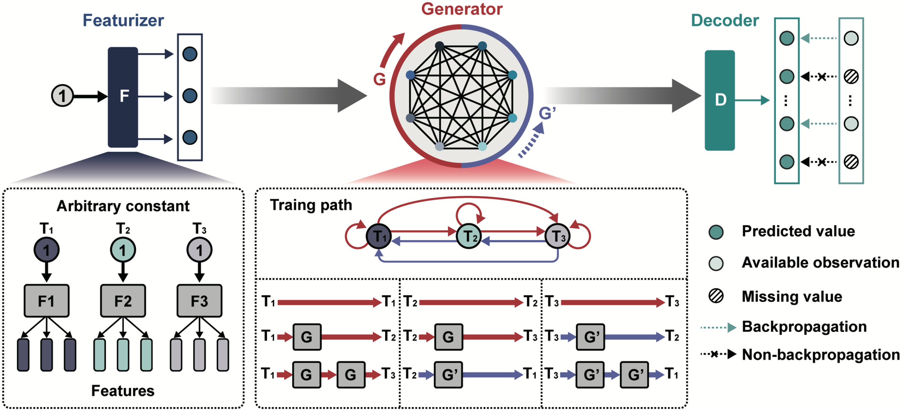

<h2 align="left">BTSTN (version 1.0)</h2>

<p align="left">
    <a href="https://www.python.org/"></a>
    <a href="https://pytorch.org/"></a>
    <a href="LICENSE"></a>
</p>

## ❖ Introduction
`BTSTN` is a Python package designed to model the metabolic dynamics from Partially-Observed Time Series based on the ***Bidrectional Time-series State Transfer Network***.

## ❖ Framework
<div align=center></div>

## ❖ System Requirements
The source code developed in Python 3.8 using PyTorch. The required python dependencies are given below.
```
torch==2.0.0
numpy>=1.23.5
pandas>=1.5.2
pypots==0.5
```

## ❖ Installation Guide
Download `btstn-v1.0.tar.gz` and execute the following command
```
$ pip install btstn-v1.0.tar.gz
```

## ❖ Data Format
|*Batch*|*Time* |*Parameter 1*|*Parameter 2*|...|
|:-:    |:-:    |:-:          |:-:          |:-:|
|__A1__ |__T1__ |2.1          |5.0          |...|
|__A1__ |__T2__ |1.4          |4.3          |...|
|__A1__ |__T3__ |3.8          |0            |...|
|__B1__ |__T1__ |2.1          |5.0          |...|
|__B1__ |__T3__ |1.4          |4.3          |...|
|__B1__ |__T4__ |3.8          |0            |...|
|__...__|__...__|...          |...          |...|

## ❖ Read Your Data
`DataReader` are used to read your file as input for model training and forecasting.

```python
import pandas as pd
from btstn import DataReader

# Load data
file_path = "xxx.csv"
data = DataReader(
    data=pd.read_csv(file_path),
    scaler="MinMax",
    unit = 1,
    dropna=False,
    sort=True,
    header=0
)
```

### ❖ Define Your Model
`BTSTN` provides a simple tool to define the structure of model and training parameters.

```python
from btstn import BTSTN

# Initialize the model
tcnits = BTSTN(
    n_features=2,
    n_dims=16,
    g_inner=32,
    g_layers=2,
    d_inner=None,
    d_layers=None,
    dropout=0.1,
    d_dropout=0,
    activation={"fc_name":"tanh"},
    max_gap=10,
    batch_size=128,
    epoch=1000,
    patience=100,
    learning_rate=0.001,
    threshold=0,
    gpu_id=-1,
    num_workers=0,
    pin_memory=False,
    saving_path=None,
    saving_prefix=None
)
```

## ❖ Train Your Model
```python
# fit the model
train_loss = tcnits.fit(data=train_dr)
```

## ❖ Application
BTSTN supported the following tasks with the trained model: imputation and forecasting. 

### 1. Imputation
`BTSTN` supported the Imputation Task (Interpolation and Extrapolation).

```python
# Imputation
impdata = tcnits.impute(
    data=data,
    max_gap_f=None,
    batch_size_f=None,
    epoch_f=None,
    patience_f=None,
    learning_rate_f=None,
    inverse=True
)
```


### 2. Forecasting
`BTSTN` supported the Forecasting Task.
```python
# Load data
mfile_path = "yyy.csv"
mdata = DataReader(
    data=pd.read_csv(mfile_path),
    scaler="MinMax",
    unit = 1,
    dropna=False,
    sort=True,
    header=0
)

# Monitor
tcnits.monitor(
    data=mdata,
    max_gap_f=10,
    batch_size_f=128,
    epoch_f=3000,
    patience_f=-1,
    learning_rate_f=0.001
)

# Forecast
foredata = tcnits.forecast(
    data=mdata,
    stime=[0],
    pred_step=99,
    multi_step=1,
    inverse=True
)
```